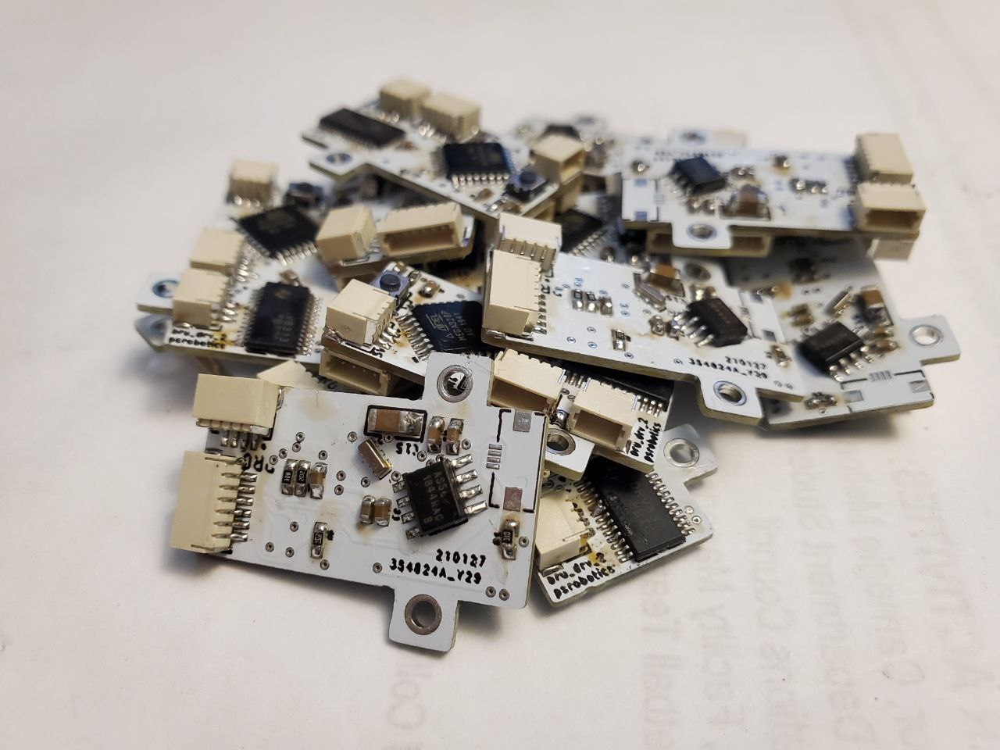
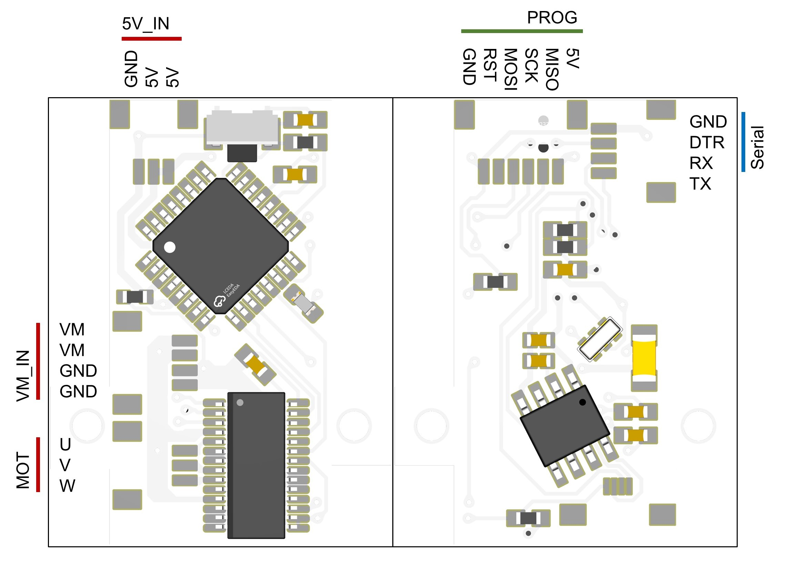

# TinyFOC_single

   
   

* Compact brushless motor driver with external encoder
* 12 bit GMR-based encoder
* Hardwarer serial interface
* Input voltage: 9v - 24v, maximum phase current 1.5A
* 4 layer board / FR4 / 1.0mm thickness
* [SimpleFOC](https://github.com/simplefoc) compatible

Design file exported with [Autodesk EAGLE](https://www.autodesk.com/products/eagle/overview?term=1-YEAR&tab=subscription)

## ICs
* MCU [Atmega328P](https://www.microchip.com/en-us/product/ATmega328P)
* Motor driver [DRV8313](https://www.ti.com/product/DRV8313?utm_source=google&utm_medium=cpc&utm_campaign=asc-null-null-GPN_EN-cpc-pf-google-wwe&utm_content=DRV8313&ds_k=DRV8313&DCM=yes&gclid=EAIaIQobChMIroSGo5PH_gIV7TatBh0lfQ1tEAAYASAAEgJeRvD_BwE&gclsrc=aw.ds)
* Encoder [AS5600](https://ams.com/en/as5600)

## Pin Out
   

## License
MIT License

## Contact
* Shuang Peng, {shuangpe}@usc.edu
